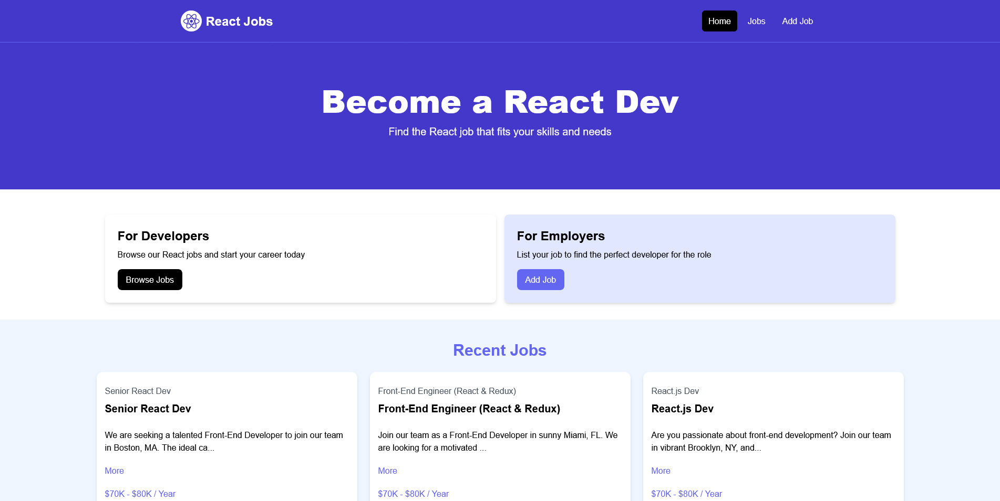

# Job Listing with React

This is a practice repository of the [Job Listing](https://youtu.be/LDB4uaJ87e0?si=XGzWIY8RcLsD8c62) project from [Traversy Media](https://www.youtube.com/@TraversyMedia).

## Table of contents

-   [Overview](#overview)
    -   [The challenge](#the-challenge)
    -   [Screenshot](#screenshot)
    -   [Links](#links)
-   [My process](#my-process)
    -   [Built with](#built-with)
    -   [What I learned](#what-i-learned)
    -   [Continued development](#continued-development)
    -   [Useful resources](#useful-resources)
-   [Author](#author)

## Overview

### The challenge

-   Understanding how to plan how to build React components
-   Understanding how to deal with React forms
-   Understanding learning to fetch data
-   Understanding how to code requests

### Screenshot



### Links

-   Solution URL: [GitHub]()
-   Live Site URL: [Vercel]()

## My process

### Built with

-   [React](https://reactjs.org/) - JS library
-   [Tailwind CSS](https://tailwindcss.com/) - CSS framework

### What I learned

While developing this project I learnt a lot of things. I learnt how to deal with React forms, how to show toast messages, how to send requests to the backend, how to organise pages or layouts.

Below you can take a look at the React component that enables the listing of jobs.

```jsx
import React, { useState, useEffect } from "react";
import JobListing from "./JobListing";
import Spinner from "./Spinner";

const JobListings = ({ isHome = false }) => {
    const [jobs, setJobs] = useState([]);
    const [loading, setLoading] = useState(true);

    useEffect(() => {
        const fetchJobs = async () => {
            const apiUrl = isHome ? "/api/jobs?_limit=3" : "/api/jobs";
            try {
                const res = await fetch(apiUrl);
                const data = await res.json();
                setJobs(data);
            } catch (error) {
                console.log("Error fetching data", error);
            } finally {
                setLoading(false);
            }
        };

        fetchJobs();
    }, []);
    return (
        <section className="bg-blue-50 px-4 py-10">
            <div className="container-xl lg:container m-auto">
                <h2 className="text-3xl font-bold text-indigo-500 mb-6 text-center">{isHome ? "Recent Jobs" : "Browse Jobs"}</h2>
                {loading ? (
                    <Spinner loading={loading} />
                ) : (
                    <div className="grid grid-cols-1 md:grid-cols-3 gap-6">
                        {jobs.map((job) => (
                            <JobListing key={job.id} job={job} />
                        ))}
                    </div>
                )}
            </div>
        </section>
    );
};

export default JobListings;
```

### Continued development

In future projects, I plan to code more real-world projects and master the React world more.

### Useful resources

-   [React Crash Course 2024](https://youtu.be/LDB4uaJ87e0?si=465iWu3jSyndJfum) - This crash course guided me to code the project available in this repository. It also served as a general course for React for me.

## Author

-   Instagram - [@mikail.afsin](https://www.instagram.com/mikail.afsin)
